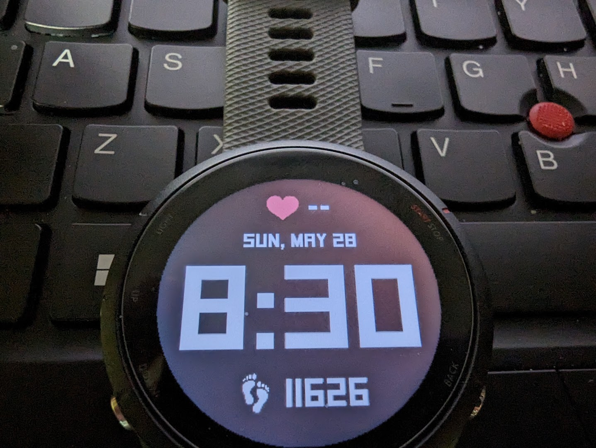

# bitface
Garmin Watch Face

This is a very simple watch face I made for my Garmin Forerunner 255. Made for my own education and because I wanted a highly visible watch face with time, date, steps and heart rate and not much else.

This will probably work on most Garmin watches, but sizes may need to be adjusted.

The current Garmin documentation pushes you towards using Visual Studio Code and the Monkey-C extension for Code. I was unable to get this working correctly on Manjaro Linux so I set up this project to use neovim and make.

Build requirements:

## Garmin ConnectIQ

https://developer.garmin.com/connect-iq/overview/

This is the SDK, tool kit and simulator used to compile the face. Install as per instructions.

You'll also need to generate a developer key per the instructions. This should go in `build_res/developer_key`.

## FontBM

https://github.com/vladimirgamalyan/fontbm

Needed to create the bitmap font from a ttf. FontBM is a Linux tool which is compatible with BMFont, a Windows tool that is usually used for this purpose.

The font used is SquareFont by Bou Fonts, found on dafont.com:  https://www.dafont.com/squarefont.font . It is listed by the author and labeled as 100% free.
